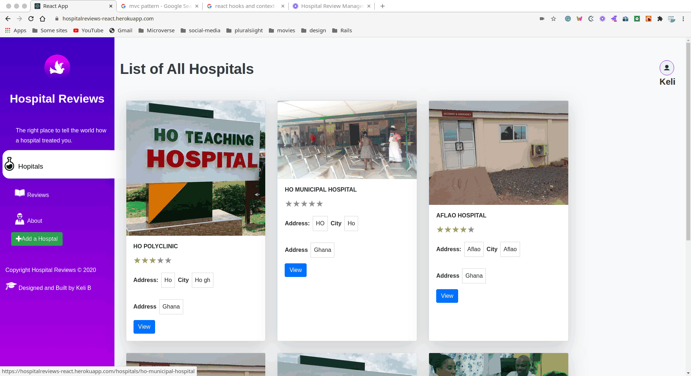

# hospitalreviews-react
A basic npx create-react-app for the hospitalreviews api


# Expectations
- one page with a list of items that could be filtered by some parameters; 
- one page for the item details; 

- Basic movies app
- Users can:
    - See all recent movies
    - Order movies by selected categories

# Screenshot


# Live Demo
[Live Demo Link](https://kelimovies.herokuapp.com/) 

[Presentation Link](https://www.loom.com/share/542e4942261c4de7a4815fa226b8844e) 

# Built With

- HTML 
- CSS
- SCSS
- BOOTSTRAP
- JAVASCRIPT
- NPM
- REACT
- NODE
- HEROKU
- ESLINT
- STYLELINT
- GITHUB ACTIONS

### Usage
- Clone the project 
```
git clone https://github.com/kelibst/react_movies.git
```
- Run `npm install` to install the local dependencies
- Run `npm start` to launch local development server
- The project should launch in your default browser
- Visit [ThemovieDb](https://www.themoviedb.org/settings/api) website and register for an api key
- create an .env file in the root folder and add 
`REACT_APP_MOVIEDB_API_KEY=YOUR_REACT_API_GOES_HERE`
- Make sure you replace `YOUR_REACT_API_GOES_HERE` with you own key


## Authors

👤 **Kelly Booster**

- Github: [@kelibst](https://github.com/kelibst)
- Twitter: [@keli_booster](https://twitter.com/keli_booster)
- Linkedin: [Kekeli (Jiresse) Dogbevi
](https://www.linkedin.com/in/kekeli-dogbevi-jiresse/)


# 🤝 Contributing
Contributions, issues and feature requests are welcome!
Feel free to check the issues page

# Show your support
Give a ⭐️ if you like this project!

This project is [MIT](lic.url) l